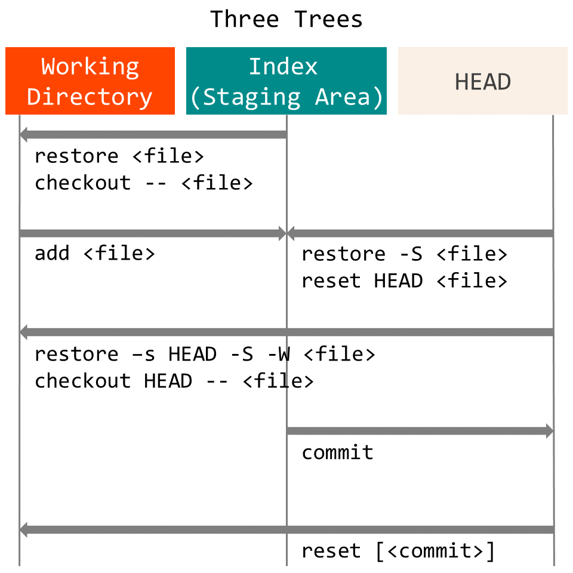

# Git-Guide

## 설정

```bash
git config --global user.name "Yongjun Cho"
git config --global user.email wphhffg@gmail.com
git config --global init.defaultBranch main
git config --global core.autocrlf input

git config --global core.editor vim

git config -l --show-origin
git config -l --show-scope
```

### VS Code 를 Git 에디터로 사용하기

- [VS Code as Git editor](https://code.visualstudio.com/docs/editor/versioncontrol#_vs-code-as-git-editor) 를 참고한다.

```bash
git config --global core.editor "code --wait"
```

VS Code 를 diff tool로 사용하기

- PowerShell 에서는 다음 커맨드를 사용한다.

```powershell
git config --global diff.tool default-difftool
git config --global difftool."default-difftool".cmd "code --wait --diff `$LOCAL `$REMOTE"
```

- bash 에서는 다음 커맨드를 사용한다.

```bash
git config --global diff.tool default-difftool
git config --global difftool."default-difftool".cmd "code --wait --diff \$LOCAL \$REMOTE"
```

## Three Trees



## diff

working directory, index, commit(HEAD) 비교

```bash
(1) git diff                        (a) index         <---> (b) working directory
(2) git diff <commit>               (a) <commit>      <---> (b) working directory
(3) git diff --staged [<commit>]    (a) <commit>=HEAD <---> (b) index
```

- (1) working directory 에서 수정한 파일을 index 와 비교한다.
- (2) working directory 에서 수정한 파일을 commit 과 비교한다. 현재 branch 의 가장 최근 commit 과 비교하려면 HEAD 를 지정한다.
- (3) 지정된 commit 과 index 를 비교한다. commit 를 생략하면 기본으로 HEAD 가 지정된다.

두 commit 간의 비교

```bash
git diff <commit> <commit>
```

## restore

```bash
git restore [<options>] [--source=<tree>] [--staged] [--worktree] [--] <pathspec>…​
```

- 파일을 index에서 working directory로 복사한다.

```bash
$ git restore <file>
```

- 파일을 HEAD에서 index로 복사한다.

```bash
$ git restore --staged <file>
```

- 파일을 HEAD에서 index와 working directory로 복사한다.

```bash
$ git restore --source=HEAD --staged --worktree <file>
```

## Line Endings

다음 두 글을 참고한다.

- [Configuring Git to handle line endings](https://docs.github.com/en/free-pro-team@latest/github/using-git/configuring-git-to-handle-line-endings)
- [Mind the End of Your Line](https://adaptivepatchwork.com/2012/03/01/mind-the-end-of-your-line/)
